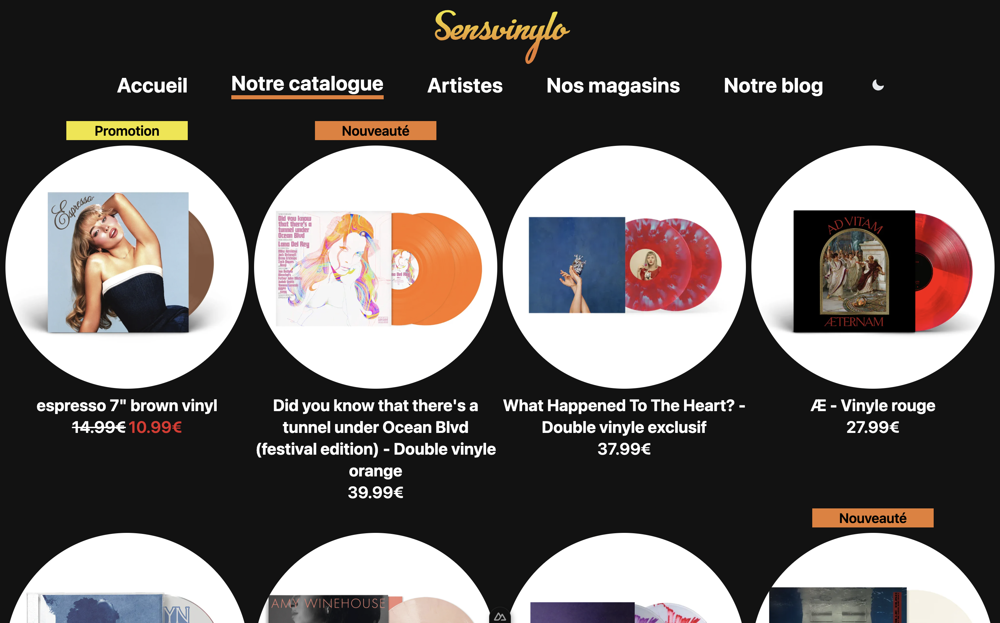
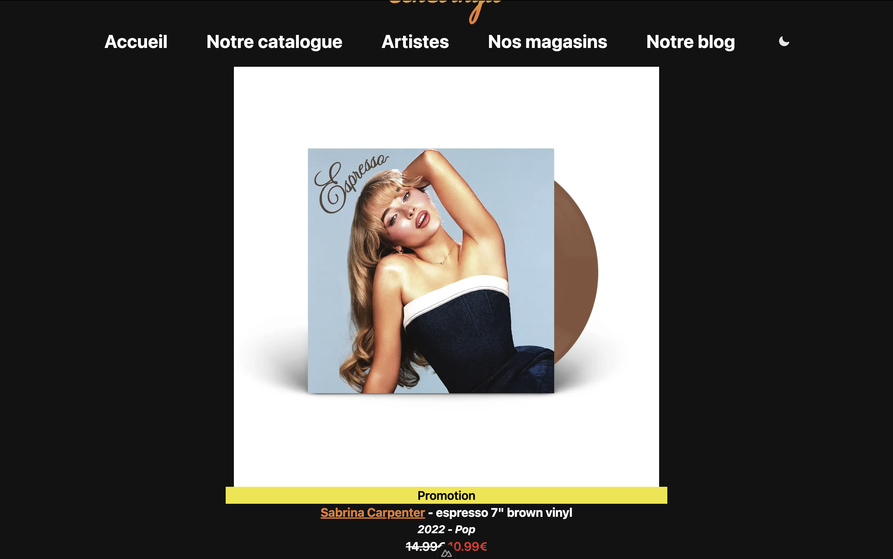

Projet de référencement naturel sur Google

Sensvinylo est un magasin de vinyles à Paris et en Ile-de-France.
Découvrez des vinyles d'occassions et des vinyles aux prix d'attractifs de vos artistes préfèrés.
Vous aimez notre site web ? N'hésistez à télécharger notre progressive web app !

## Tech Stack

TypeScript - Vue - Nuxt - Tailwind CSS

## Screenshots







## Design de l'application

| Couleur principale             | Hex                                                                |
| ----------------- | ------------------------------------------------------------------ |
| Red|  #e52828 |
| Orange |  #e97c2f |
| Yellow |  #f0e52b |
| Black |  #000000 |
| White |  #FFFFFF |

## Authors
- [Inès](https://github.com/ines-mgg)
- [Stéphan](https://github.com/StephanG2a)


# Nuxt 3 Minimal Starter

Look at the [Nuxt 3 documentation](https://nuxt.com/docs/getting-started/introduction) to learn more.

## Setup

Make sure to install the dependencies:

```bash
# npm
npm install

# pnpm
pnpm install

# yarn
yarn install

# bun
bun install
```

## Development Server

Start the development server on `http://localhost:3000`:

```bash
# npm
npm run dev

# pnpm
pnpm run dev

# yarn
yarn dev

# bun
bun run dev
```

## Production

Build the application for production:

```bash
# npm
npm run build

# pnpm
pnpm run build

# yarn
yarn build

# bun
bun run build
```

Locally preview production build:

```bash
# npm
npm run preview

# pnpm
pnpm run preview

# yarn
yarn preview

# bun
bun run preview
```

Check out the [deployment documentation](https://nuxt.com/docs/getting-started/deployment) for more information.
